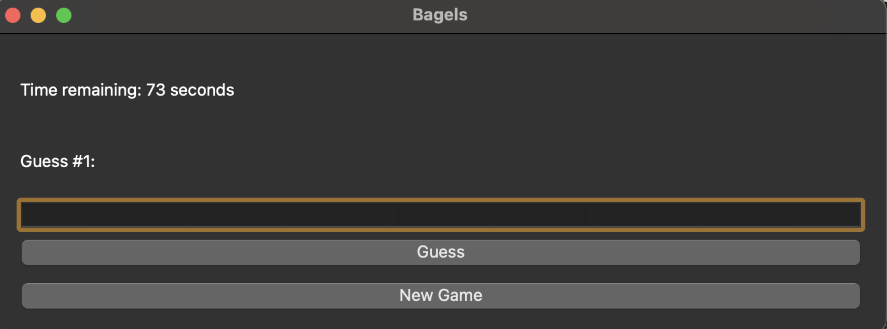

# Bagels Game

This is a deductive logic game called Bagels. The game is about guessing a secret number with no repeated digits in it. The game will give you clues based on your guesses.

# How to Play

- When you start the game, it will generate a random 3-digit number with no repeated digits. Your task is to guess the number within 90 tries. After each guess, the game will give you clues to help you guess the number.

- To guess the number, enter a 3-digit number with no repeated digits in the text field and click the "Guess" button. The game will tell you if your guess is too high, too low, or correct.

- You can start a new game anytime by clicking the "New Game" button.

# Requirements

Python 3.x

PyQt6

# How to Run

- Clone the repository.
- Install the required packages.
- Run python3 bagels.py in your terminal.

